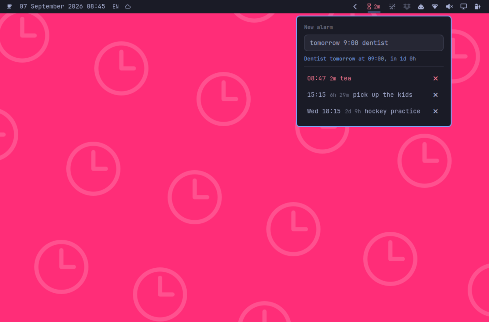

# Nag

Disposable alarms for the Omarchy bar. Type `15:15 pick up the kids` into one field and it is set. The bar counts down to it, turns red in the last five minutes, and then keeps going until you answer it.

It exists because an alarm for quarter past three today is not an appointment. Putting it in a calendar gives it a life it does not deserve: it syncs to your phone, it shows up in next week's agenda view, and you have to go back and delete it. Nag is the other thing, the one a kitchen timer does, with the difference that you can say what it is for.

Named after and inspired by [Pester](https://sabi.net/nriley/software/) by Nicholas Riley, which has done this on the Mac since 2002.



## What you can type

The field takes the time and the message together, and works out where one ends and the other begins.

| You type | You get |
| --- | --- |
| `5m tea` | five minutes from now |
| `90s` | ninety seconds, no message |
| `1h30 call Paul` | an hour and a half from now |
| `15:15 pick up the kids` | quarter past three today, or tomorrow if it has gone |
| `9pm laundry` | tonight |
| `tomorrow 9:00 dentist` | tomorrow morning |
| `wed 18:15 hockey` | the next Wednesday |
| `next monday 8:00 standup` | as it says |
| `2d water the plants` | two days from now |
| `dec 25 9:00 call mum` | a date further out |
| `5분 차 마시기` | five minutes from now |
| `다섯시삼십분 아이 데리러` | half past five |
| `오후 다섯시 퇴근` | five in the afternoon |
| `십오분 정리` | fifteen minutes from now |
| `하루 뒤 복습` | a day from now |
| `내일 9:00 치과` | tomorrow morning |
| `수요일 18:15 하키` | the next Wednesday |
| `12월 25일 9:00 엄마에게 전화` | a date further out |

A bare number is minutes, so `5` is five minutes, which is what `omarchy reminder` takes too. Durations also accept the spelled-out units (`min`, `hour`, `days`) and `u` for uur.

The line under the field shows what was understood before you commit to it, in the same words the bar will use afterwards. That is the point of it: `wed 18:15 hockey` reading back as "Hockey Wednesday at 18:15" tells you the Wednesday went into the time and not into the message.

### Korean

Korean works by translation, not by a second parser: `5분 차 마시기`, `90초`, `2시간 회의`, `1시간 30분 폴에게 전화`, `오후 3시 아이 데리러`, `3시 반 커피`, `내일 9:00 치과`, `모레 점심`, `수요일 18:15 하키`, `다음주 월요일 8:00 스탠드업`, `3일 물주기`, `12월 25일 9:00 엄마에게 전화`. Spaces between the time and the message are optional (`내일9시`), `후` and `뒤` are understood and dropped (`5분 후 알람`).

Numerals work in Arabic and in hangul: `5분`, `다섯시`, `다섯시삼십분`, `다섯 시 반`, `오후 다섯시`, `두시간 반`, `반시간`, `십오분`, `이십오분`, `하루`, `이틀`, `사흘`. Weekdays need the full 요일 form, because bare `수` and `금` are ordinary words and guessing at them is how an alarm lands on the wrong day. Without `오전`/`오후`, an hour is the 24-hour clock, so `3시` and `다섯시` are three and five in the morning; the read-back line says which it took before you press Enter. The read-back itself speaks English regardless.

## Keys

Everything works without the mouse, and the field keeps the focus the whole time so you can keep typing.

| Key | What it does |
| --- | --- |
| `Enter` | set the alarm |
| `Down` and `Up` | walk into the list of alarms and back out |
| `Enter` on a ringing alarm | snooze it five minutes |
| `Delete` on an alarm | remove it, or dismiss it if it is ringing |
| `Escape` | leave the list, then close the panel |

Typing anything takes the cursor back out of the list, so you never have to think about which mode you are in.

## When it goes off

A critical notification, the freedesktop alarm sound, and the bar widget pulsing red. The alarm keeps ringing in the panel until you dismiss or snooze it, because an alarm that clears itself after a few seconds is one you can miss, and missing it is the whole thing this is meant to prevent. Clicking the notification opens the panel.

## Setting one from anywhere

`nag ask` opens the panel wherever you are, so setting an alarm is one keystroke away from any workspace. It is the same panel with the same line reading back what it understood, because a second, simpler prompt somewhere else would be one that cannot tell you what it made of what you typed. If there is no Nag widget in your bar to open, it falls back to the Omarchy menu's text prompt and confirms with a notification instead.

Add it to your menu by putting this in `~/.config/omarchy/extensions/omarchy-menu.jsonc`:

```jsonc
"nag": {
  "icon": "󰔟",
  "label": "Nag",
  "description": "Set a disposable alarm",
  "action": "$HOME/.config/omarchy/plugins/jankeesvw.nag/bin/nag ask"
}
```

Or bind it to a key in `~/.config/hypr/bindings.conf`:

```
bindd = SUPER, N, Set an alarm, exec, $HOME/.config/omarchy/plugins/jankeesvw.nag/bin/nag ask
```

The panel also opens with `omarchy-shell shell toggle jankeesvw.nag`, which closes it again on the same key.

## Install

```sh
omarchy plugin add https://github.com/jankeesvw/omarchy-nag.git --enable
omarchy bar move jankeesvw.nag --section right
```

Update an installed copy with `omarchy plugin update jankeesvw.nag`.

Nothing to configure, no account, no API key. It needs `jq`, `dd`, `date` and `systemd-run`, which Omarchy already has, and it plays the alarm through `pw-play` with a sound from the `sound-theme-freedesktop` package.

## How it works, and why that matters

Alarms are systemd user timers, set with `--on-calendar` against wall-clock time. That is what makes them survive a shell restart, a Quickshell crash and a suspend. It is also the one behavioural difference from the built-in `omarchy reminder`, which uses `--on-active`: those count monotonic seconds, which stop while the machine sleeps, so a reminder set for 15:15 fires late by however long the lid was shut.

Every alarm is written to disk as well, and the plugin re-arms any timer that has gone missing while its time is still ahead. That covers a reboot, which transient systemd units do not survive on their own.

There is no network access of any kind. Nothing is sent anywhere, and nothing is fetched.

## Taking a screenshot of it

`nag demo on` swaps the alarm list for three invented ones at fixed offsets from now, so a screenshot is reproducible and shows nothing of yours. While it is on, every write is a no-op: a click during a shoot cannot cancel a real alarm, and nothing fires. `nag demo off` puts your own alarms back and refreshes the bar at once, so the widget cannot be left showing invented data.

```sh
nag demo on
nag demo status
nag demo off
```

## Files it writes

Everything lives under `~/.local/state/nag`, created 0700, with each file 0600:

- `alarms/<id>.json` for each pending alarm, holding its time and its message
- `ringing/<id>.json` for an alarm that has gone off and is waiting to be answered
- `demo`, an empty marker file, only while demo mode is on

Your alarm messages are in those files, so treat them as you would any note to yourself.

It also creates one transient systemd user unit per alarm, named `nag-<id>.timer`, and it does not touch your Hyprland configuration, `shell.json`, or any other plugin's files.

## Removing it

```sh
omarchy plugin remove jankeesvw.nag
```

Two things survive that, and both need one command each.

Alarms that have not gone off yet are systemd timers, and they keep running after the plugin directory is gone. Stop them before or after removal, which works either way because it does not need the plugin:

```sh
systemctl --user stop 'nag-*.timer'
```

Your stored alarms and messages stay on disk. Delete them if you want them gone:

```sh
rm -rf ~/.local/state/nag
```

If you added the menu row or the keybinding above, remove those lines by hand as well. The plugin never wrote them.

## Licence

MIT. See [LICENSE](LICENSE).
